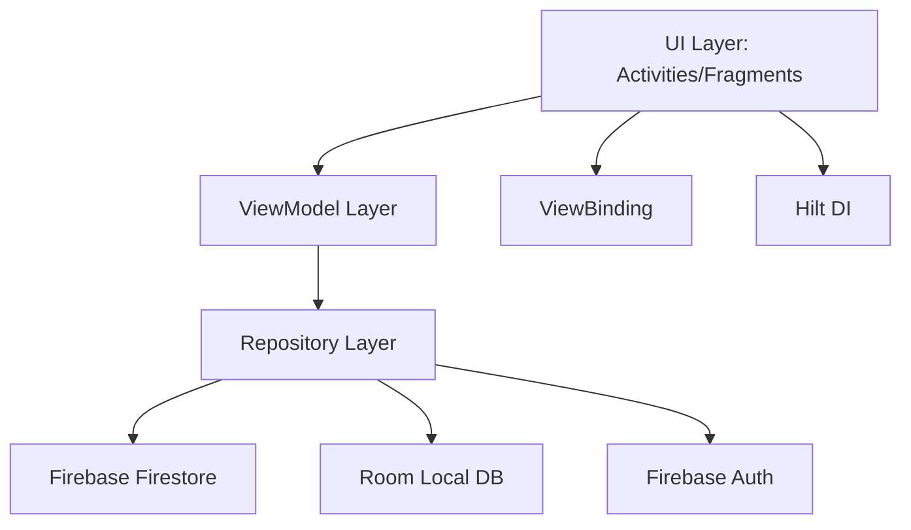
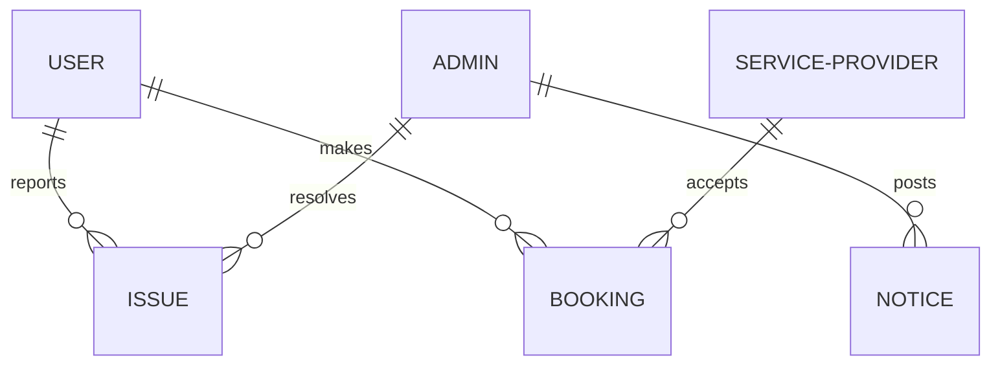

# Project Report: Local-Connect

## 1. Project Overview
**Local-Connect** is a modern Android application designed to facilitate local community interactions. It allows users to report issues (like potholes or sanitation problems), discover nearby services, and receive official notices from administrators. The app bridges the gap between citizens, service providers, and local government.

## 2. Technical Stack
The project leverages a robust and modern tech stack to ensure scalability, performance, and a premium user experience.

| Category | Technologies Used |
| :--- | :--- |
| **Language** | Java (JDK 17) |
| **Platform** | Android (Min SDK 24, Target SDK 34) |
| **Architecture** | MVVM (Model-View-ViewModel) with Activity/Fragment UI |
| **Dependency Injection** | Hilt (Dagger-Hilt) |
| **Database (Remote)** | Firebase Firestore (Real-time NoSQL) |
| **Database (Local)** | Room Persistence Library (SQLite abstraction) |
| **Authentication** | Firebase Authentication |
| **Asset Storage** | Firebase Storage / Base64 in Firestore |
| **Image Processing** | Glide (Loading), uCrop (Cropping), GPUImage (Filters) |
| **Maps & Location** | OpenStreetMap (osmdroid) & Play Services Location |
| **Background Tasks** | WorkManager |
| **Media** | Media3 ExoPlayer |

## 3. Project Architecture
The application follows the **MVVM (Model-View-ViewModel)** architectural pattern, ensuring a clean separation of concerns.

### Architecture Diagram

## 4. Modules and Packages
The codebase is organized into logical packages:

- **`data`**: Contains Repositories and DAOs that handle data operations from both Firebase and Room.
- **`model`**: Defines the data entities (e.g., `User`, `Notice`, `Issue`, `ServiceProvider`).
- **`ui`**: The largest module, containing UI components organized by user roles (Admin, User, Provider).
- **`util`**: Helper classes for image conversion (Base64), session management, and UI utilities.
- **`worker`**: Background tasks handled by WorkManager (e.g., syncing data).
- **`service`**: Android Services for persistent background operations.

## 5. Database Design
The project uses a hybrid database approach: **Firebase Firestore** for cloud synchronization and **Room** for local persistence and offline access.

### A. Firestore Collections (Cloud Schema)
Firestore stores data in a NoSQL document format. Key collections include:

| Collection | Description | Key Fields |
| :--- | :--- | :--- |
| `users` | Regular app users | `id`, `name`, `phone`, `pincode`, `password`, `profileImageUrl`, `bio` |
| `service_providers` | Local service entities | `id`, `name`, `category`, `phone`, `pincode`, `verified`, `rating` |
| `issues` | Community reported issues | `id`, `description`, `imagePath` (Base64), `pincode`, `status`, `reporterName`, `latitude`, `longitude` |
| `notices` | Admin announcements | `id`, `title`, `content`, `timestamp`, `pincode` |
| `bookings` | Appointments with providers | `id`, `userId`, `providerId`, `date`, `status` |

### B. Room Database (Local Schema)
Room mirrors Firestore data for offline capabilities. Entities include:

- **`users` Table**: Primary key `id`. Stores user profile and credentials.
- **`issues` Table**: Stores local copies of reported issues with fields for geofencing and forwarding data.
- **`service_providers` Table**: Cached list of nearby service providers.
- **`notices` Table**: Local cache of administrative notices.
- **`bookings` Table**: Tracks user appointments locally.

### C. Data Relationships

## 6. Key Components & Implementation

### A. Issue Reporting & Management
- Users can report local issues with images.
- Integration with **OpenStreetMap (osmdroid)** for pinpointing locations.
- Administrative control to resolve or update the status of these issues.

### B. Admin Notice System
- Dynamic notice board where admins can post updates.
- Real-time updates delivered via Firestore listeners.

### C. Service Discovery
- A directory of local service providers categorized by type.
- Implementation of location-based filtering.

### D. Advanced Image Editing
- **uCrop Integration**: Allows users to crop profile pictures or issue images.
- **GPUImage Filters**: Premium feature to apply visual filters to images.
- **Base64 Storage**: Efficient handled to store images directly in the database for instant retrieval.

## 6. Project Pipeline (Build & Data Flow)
1. **Compilation**: Managed by **Gradle (Kotlin DSL)**, ensuring all dependencies are resolved.
2. **Dependency Injection**: **Hilt** automatically provides instances of Repositories and ViewModels.
3. **Data Flow**:
    - User interacts with the UI (View).
    - UI triggers actions in the ViewModel.
    - ViewModel requests data from the Repository.
    - Repository decides whether to fetch from local Room DB or remote Firestore.
    - Results are observed back in the UI via LiveData or StateFlow.
4. **Build Output**: Standard Android APK/AAB generation.

## 7. Conclusion
Local-Connect is a comprehensive solution for local connectivity, combining real-time cloud data with local persistence and advanced UI features like custom image editing and mapping.
